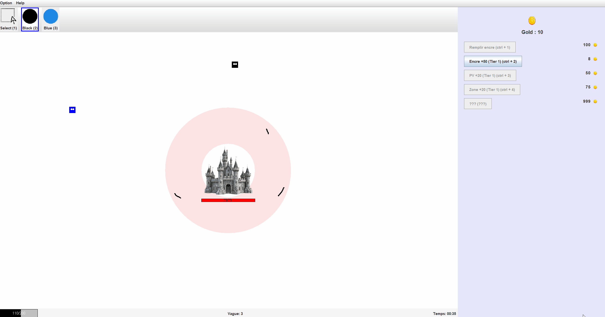

# Paint Tower Defense - Rapport Command Pattern
- Auteurs: Bleuer Rémy, Changanaqui Yoann, Richard Aurélien
- Date: 14.06.25
- Version: 1.0
- Classe: MCR-A
- Git Repository (code source) : https://github.com/RemyBlr/MCR_Lab03_pattern_study

## Contexte
Ce projet est une application Java "Paint Tower Defense". Le joueur doit protéger un château en dessinant des murs 
dans une zone délimitée.

Il affronte des vagues d’ennemis de plus en plus nombreuses et puissantes, et peut acheter des améliorations pour
renforcer sa défense et survivre jusqu'à la vague 999 où les choses se complique .)

L'interface est réalisée avec Swing et l'application utilise le pattern Command pour gérer les différentes actions
de l'utilisateur.



## Déploiement et utilisation

Cloner le projet,
```shell
git clone https://github.com/RemyBlr/MCR_Lab03_pattern_study
```

Lancer le programme depuis votre IDE préféré ou bien a la racine du projet avec les commandes suivantes,
```shell
# Compiler
javac -d out -cp src src/app/*.java src/game/*.java src/game/enemies/*.java src/tools/*.java src/window/*.java src/command/*.java

# Exécuter
java -cp out app.Main 200 20 2500
```

Et voilà, vous devriez vous retrouver avec le programme qui ouvre une fenêtre dont le jeu est exécuté. *(attendez 2-3 secondes pour voir apparaître les premiers ennemies)*

### Utilisation

- Clic gauche : dessine un mur (si assez d'encre)
- Barre d'outils : change d'outil (pinceau couleur ou sélection)
- Shop : achat d'améliorations
- Bouton reset : reset
- Help : affiche l'aide

#### Raccourcis

- **p** : pause/unpause
- **ctrl + z** : annule dernière commande (dessin/déplacement mur)
- **1 - 6** : sélection d'outil
- **ctrl + 1 - ctrl + 4** : achat d'améliorations
- **ctrl + h** : mystère....

## Mise en œuvre du modèle
Le projet est organisé en plusieurs packages :
- `app`: contient la classe principale `Main` qui lance l'application.
- `command`: rassemble les actions exécutables (pattern Command) telles que dessiner un mur ou l'ajout d'encre.
- `game`: gère l'état global du jeu (class `Game` singleton, les vagues d'ennemis, châteaux, murs.)
  - `enemies`: regroupe les classes liées aux ennemis.
- `tools`: regroupe les outils de dessin et de gestion des murs.
- `window`: contient les composants Swing pour l'interface utilisateur.

### Fonctionnement du jeu
La classe `Game` est un singleton qui conserve son état (par ex: la quantité d'encre qui est disponible, l'or récolté et la
liste des murs construits). Elle met à jour les ennemis et notifie les observeurs à chaque tick de la boucle de jeu.

Les interactions de l'utilisateur passent par le pattern Command. Par exemple, la commande `CreateWallCommand` retire
l'encre nécessaire puis enregistre un nouveau mur dans la partie. Ces commandes peuvent être annulées via le 
`CommandManager` si elles implémentent la classe `UndoableCommand`.

`ToolManager` conserve l'outil de dessin sélectionné (couleur, sélection) et informe l'interface lorsque l'outil change.

La fenêtre principale `TDWindow` configure les raccourcis clavier et gère les différents panneaux : zone de dessin,
shop et barre d'état.

Les vagues d'ennemis sont créées par des fabriques `EnemyFactory`. En mode normal, la fabrique génère 25 ennemis choisis
aléatoirement.

### Pattern Command
#### Les interfaces

Le pattern *Command* a été utilisé afin de gérer les interactions avec le jeu.
Nous avons deux interfaces permettant l'implémentation de Commandes :

```Java
public interface Command {
    /**
     * Executes the command.
     */
    void execute();
}

public interface UndoableCommand extends Command {
    /**
     * Undo the command
     */
    void undo();
}
```

La première est pour les commandes simples, pouvant être seulement exécutées.
La seconde rajoute la fonction `undo()` qui permet à la commande d'annuler son exécution (et donc de "revenir en arrière").

Les commandes implémentent donc l'une des deux interfaces afin de pouvoir effectuer des actions sur le jeu.

#### Exemple d'implémentation (UndoableCommand)

Voici un exemple d'implémentation pour une commande Undoable (que l'on peut annuler). Ici cette commande est une commande de changement d'encre qui va s'effectuer sur le jeu. Avec possibilité de l'annuler avec la commande `undo()`.

```Java
public class ChangeInkCommand implements UndoableCommand{
    private final int amount;

    /**
     * Constructor for ChangeInkCommand.
     *
     * @param amount The amount of ink to change.
     */
    public ChangeInkCommand(int amount) {
        this.amount = amount;
    }

    @Override
    public void execute() { Game.getInstance().setInk(amount); }

    @Override
    public void undo() { Game.getInstance().setInk(-amount); }
}
```

#### Commande composite

Nous avons aussi la possibilité d'avoir des commandes composites, des commandes regroupant plusieurs commandes (par exemple, une macro). Nous pouvons donc ajouter des commandes à la composite (uniquement des UndoableCommand pour ce cas) et ensuite exécuter. 

La composite va pouvoir exécuter toutes ces commandes ainsi que de les annuler.

```Java
public class CompositeCommand implements UndoableCommand {
    private final List<UndoableCommand> commands = new ArrayList<>();

    /**
     * Adds a command to the composite command.
     * @param command The command to add.
     */
    public void addCommand(UndoableCommand command) { commands.add(command); }

    @Override
    public void execute() {
        for (UndoableCommand command : commands)
            command.execute();
    }

    @Override
    public void undo() {
        ListIterator<UndoableCommand> it = commands.listIterator(commands.size());
        while (it.hasPrevious())
            it.previous().undo();
    }
}
```

#### Le CommandManager

Il est responsable d'exécuter les commandes qu'il reçoit et de garder un historique des `UndoableCommand` reçues afin de pouvoir les annuler si l'on le souhaite plus tard.

```Java
/**
 * CommandManager is responsible for managing the execution of commands.
 * It maintains a history of executed commands, allowing for undo functionality.
 */
public class CommandManager {
    private final Stack<UndoableCommand> history = new Stack<>();

    /**
     * Executes a command without pushing it onto the history stack.
     *
     * @param command The command to execute.
     */
    public void executeCommand(Command command) {
        command.execute();
    }

    /**
     * Executes a command and pushes it onto the history stack.
     *
     * @param command The command to execute.
     */
    public void executeCommand(UndoableCommand command) {
        command.execute();
        history.push(command);
    }

    /**
     * Undoes the last executed command.
     * If there are no commands in the history, nothing happens.
     */
    public void undo() {
        if(!history.isEmpty()) {
            UndoableCommand command = history.pop();
            command.undo();
        }
    }

    /**
     * Records a command in the history stack without executing it.
     * @param command The command to record.
     */
    public void recordCommand(UndoableCommand command) {
        history.push(command);
    }
}
```

### Pattern Observer

Il est judicieux d'aussi mentionner que le pattern observer a été utilisé afin d'informer les éléments d'interfaçage graphique que le jeu a avancé.

A chaque fin d'itération du jeu (à la fin de `tick()`) les observateurs sont notifiés. Ils vont ensuite pouvoir se mettre à jour en appelant le singleton `Game` et en mettant à jour leurs informations en se basant sur l'état de ce dernier.

## UML

Nous avons décidé "d'éclater" l'UML en plusieurs schémas afin de rendre le tout lisible et de ne pas avoir un monstre de diagramme impossible à déchiffrer. Nous affichons ici seulement l'UML pour Command, les autres se trouvent en fin de rapport.


## Conclusion

Ce projet met en œuvre plusieurs patterns vus en cours, avec un focus principalement sur le **pattern Command**.

Ce pattern nous a permis de gérer proprement les actions du joueur, d'ajouter la possibilité d'annuler des actions et de garder un code clair et modulaire.

L’interface (Swing) est fonctionnelle, et la séparation entre la logique du jeu et de l'affichage facilitera les évolutions futures et permet d'éventuellement changer d'interface graphique sans avoir d'impacts sur la logique du jeu.

## Autres UMLs

Voici les autres UMLs afin de ne pas polluer le rapport.


